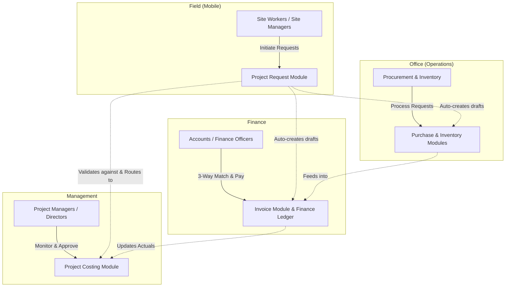
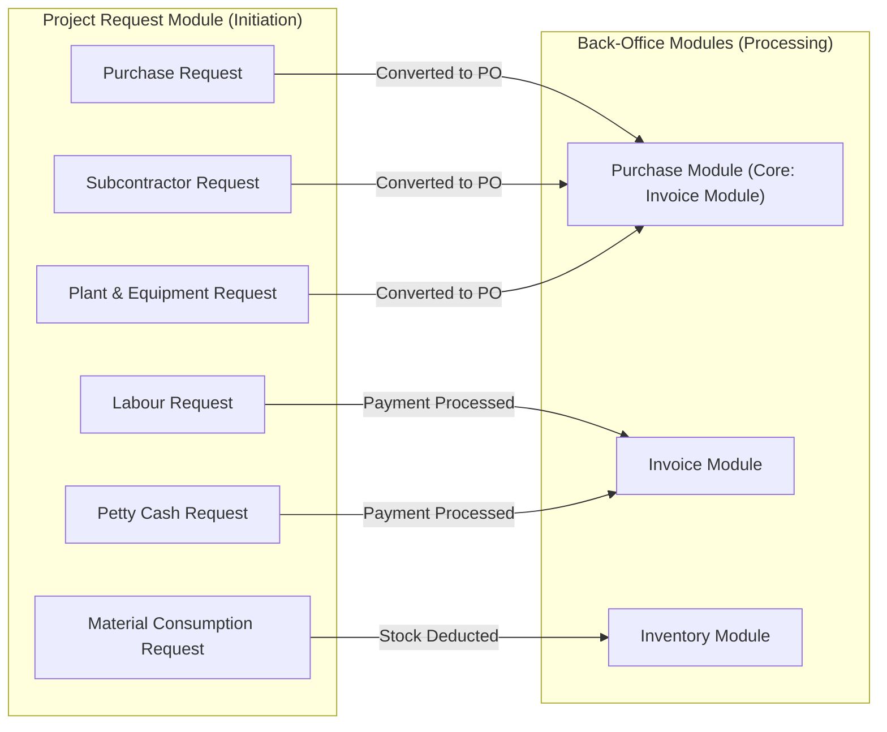
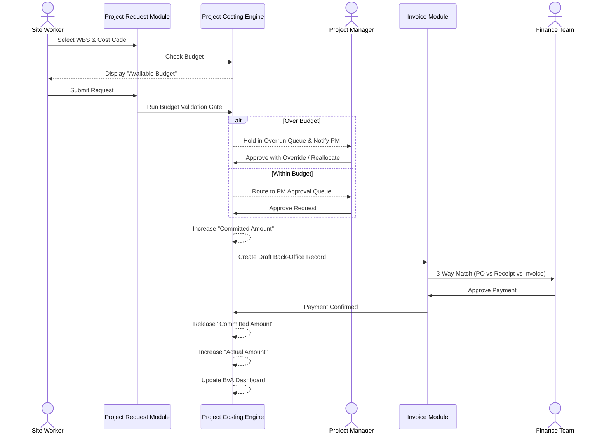
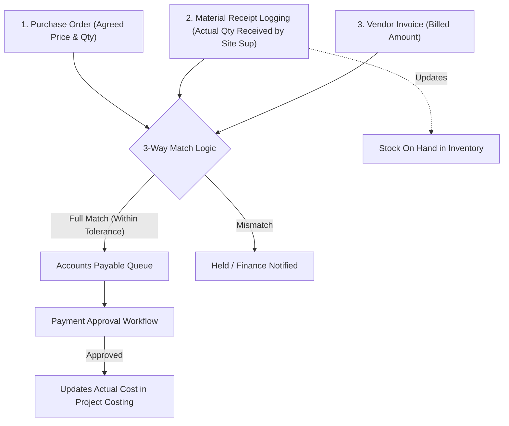
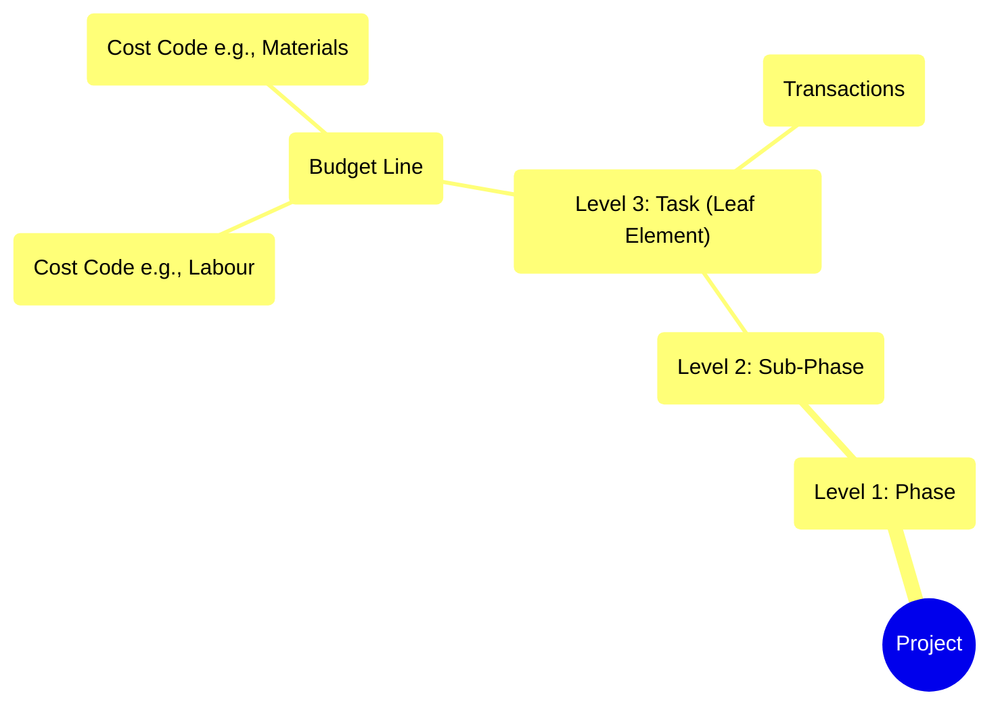

# FastraSuite System Mapping & Data Flow

This document provides a comprehensive mapping of the FastraSuite ecosystem based on the PRD Addendum (v1.1), detailing the interactions between user roles, modules, request types, and the financial costing engine.

## 1. High-Level Architecture & User Layers

FastraSuite separates operational responsibilities across four distinct layers, each interacting with specific modules.

## 2. Request Types & Routing

All spending and material requests originate from the **Project Request Module** and are routed to back-office modules upon approval. Every request must be tagged with a **WBS Element** and a **Cost Code**.

## 3. End-to-End Financial Data Flow

This diagram illustrates the lifecycle of a request from submission to final payment, highlighting how the **Budget Validation Gate** and the **Costing Engine** track Committed and Actual amounts.

## 4. The 3-Way Match & Inventory Flow

Before any vendor payment is processed in the Invoice Module, the system enforces a strict 3-Way Match to prevent overpayment and ensure materials were actually received on-site.

## 5. Costing Engine Budget Formula

The core formula governing the Budget Validation Gate is calculated in real-time for every specific WBS Element + Cost Code combination:

> **Available Budget = Budgeted Amount − Actual Amount − Committed Amount**

*   **Budgeted Amount**: Approved project budget.
*   **Actual Amount**: Confirmed payments (Invoice Module) + Validated Material Consumption (Inventory Module).
*   **Committed Amount**: Approved, but unpaid requests/POs. *(Note: Material Consumption skips this stage and goes directly to Actual).*

## 6. Project & WBS Hierarchy

*Budget lines and transactions can **only** be attached to Leaf Elements (the lowest level of the WBS hierarchy).*
